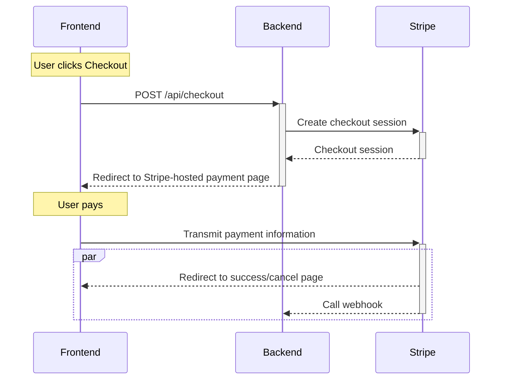

## Overview

Demonstrates a simple Next.js checkout page which uses Stripe for processing payments.

## Sequence Diagram

```mermaid
sequenceDiagram
  Note over Frontend: User clicks Checkout
  Frontend->>+Backend: POST /api/checkout
  Backend->>+Stripe: Create checkout session
  Stripe-->>-Backend: Checkout session
  Backend-->>-Frontend: Redirect to Stripe-hosted payment page
  Note over Frontend: User pays
    Frontend->>+Stripe: Transmit payment information
  par
    Stripe-->>Frontend: Redirect to success/cancel page
    Stripe-->>-Backend: Call webhook
  end
```
